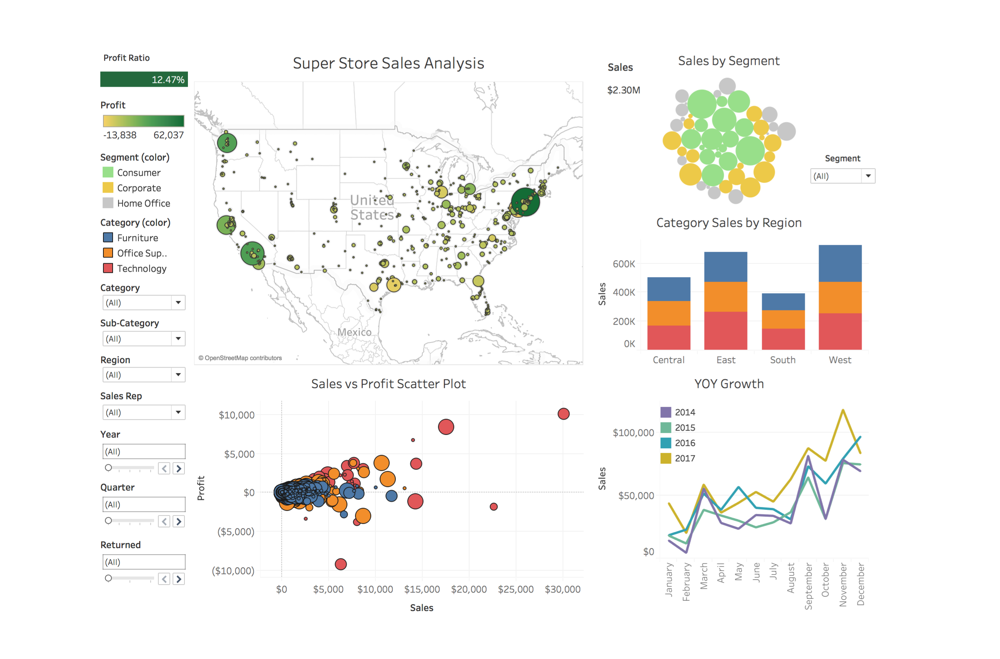
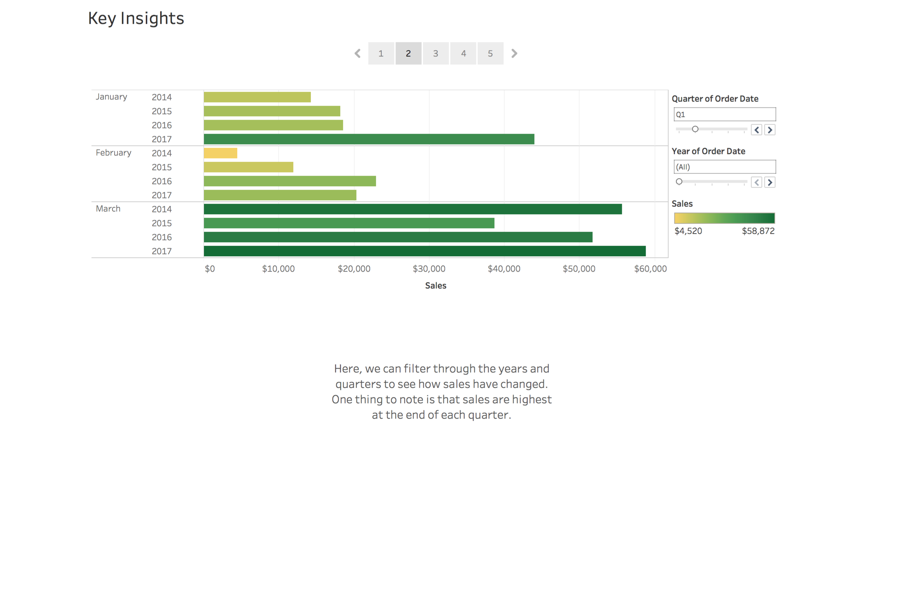
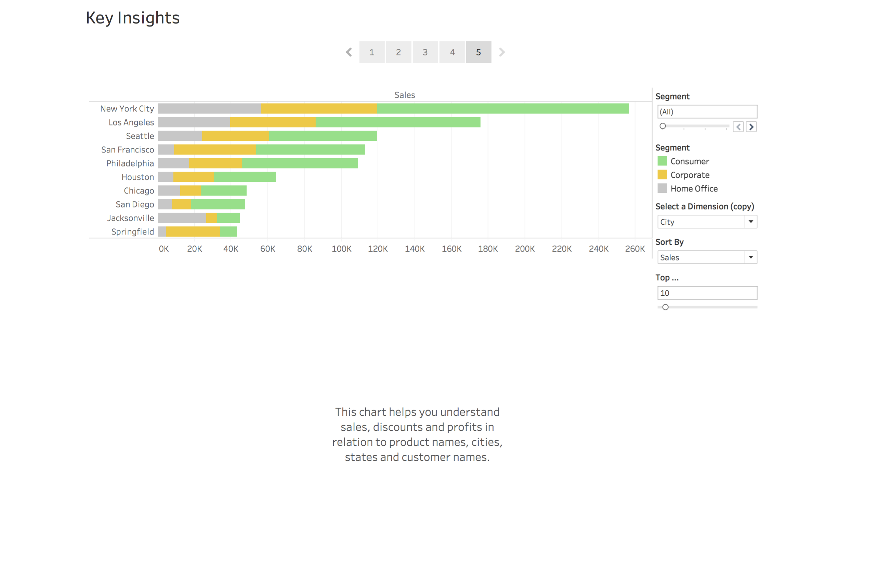

# Super Store Dashboard

### Tableau Project analyzing Tableau's SuperStore data set

For this project I analyzed the SuperStore data set provided by Tableau. My goal for this project was to create a dashboard that could be dynamic and useful for a sales person. The dashboard is highly interactive in that when you filter by salesperson, year, quarter, etc... all the visualizations change. 

Overall, sales have increased year over year, but sales do not always mean profits. The company is losing money on items such as furniture and must reconsider if they should continue to sell these products. There also seems to be a negative linear relationship with discounts and profits. Higher discounts, means less smaller profits. Why are some items heavily discounted over others? These are some questions that the company should address after analyzing their sales from the last 4 years.

## Copyright

ABFdata (C) 2018. All Rights Reserved.